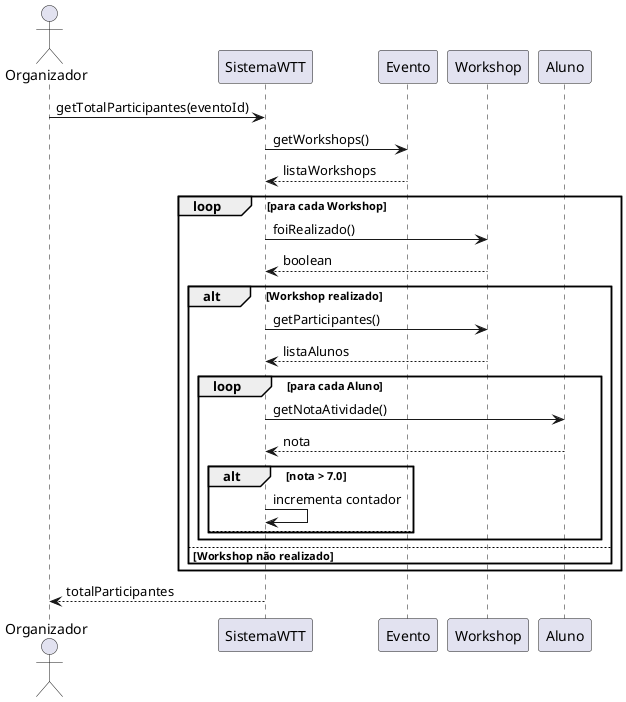

```plantuml
@startuml
actor Organizador
participant SistemaWTT
participant Evento
participant Workshop
participant Aluno

Organizador -> SistemaWTT : getTotalParticipantes(eventoId)

SistemaWTT -> Evento : getWorkshops()
Evento --> SistemaWTT : listaWorkshops

loop para cada Workshop
    SistemaWTT -> Workshop : foiRealizado()
    Workshop --> SistemaWTT : boolean

    alt Workshop realizado
        SistemaWTT -> Workshop : getParticipantes()
        Workshop --> SistemaWTT : listaAlunos

        loop para cada Aluno
            SistemaWTT -> Aluno : getNotaAtividade()
            Aluno --> SistemaWTT : nota

            alt nota > 7.0
                SistemaWTT -> SistemaWTT : incrementa contador
            else
                ' nenhuma ação
            end alt
        end loop

    else Workshop não realizado
        ' ignorar
    end alt

end loop

SistemaWTT --> Organizador : totalParticipantes
@enduml
```
