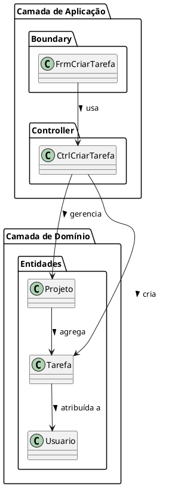

```plantuml
@startuml
' ===========================================
'   DIAGRAMA DE PACOTES (RF07 - Criar Tarefa)
' ===========================================

package "Camada de Aplicação" {
    package "Boundary" {
        class FrmCriarTarefa
    }
    
    package "Controller" {
        class CtrlCriarTarefa
    }
}

package "Camada de Domínio" {
    package "Entidades" {
        class Projeto
        class Tarefa
        class Usuario
    }
}

' Relações entre pacotes
FrmCriarTarefa --> CtrlCriarTarefa : usa >
CtrlCriarTarefa --> Projeto : gerencia >
CtrlCriarTarefa --> Tarefa : cria >
Projeto --> Tarefa : agrega >
Tarefa --> Usuario : atribuída a >

@enduml
```
